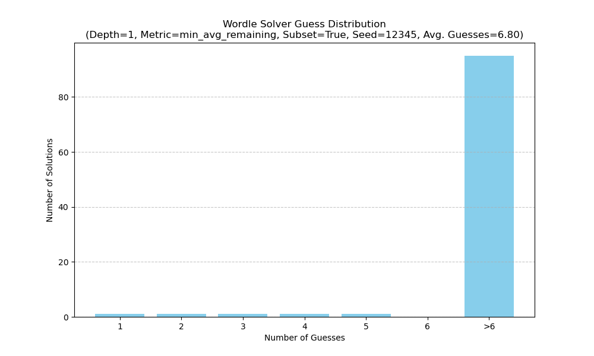

# Test Report: Wordle Solver Simulation

## 1. What was done
A simulation was run using the Wordle solver against a subset of 100 words from the `wordle_answers.txt` list (Random Seed: 12345). The set of allowed guesses was also limited to this same subset.

## 2. Why it was done
This test was performed to evaluate the performance of the Wordle solver.

## 3. What was specifically tested
The solver's performance was tested with the following configuration:
*   **Search Depth**: 1 (greedy approach)
*   **Optimization Metric**: `min_avg_remaining` (minimizing average remaining solutions)
*   **Dataset**: Subset of 100 words from `wordle_answers.txt` for both solutions and allowed guesses (Random Seed: 12345).

## 4. Results
```

--- Solver Performance Report ---
Total solutions simulated: 100
Used a subset of 100 words for both solutions and guesses (Random Seed: 12345).
Average guesses per game: 6.80

Guess Distribution:
  1 tries: 1 solutions
  2 tries: 1 solutions
  3 tries: 1 solutions
  4 tries: 1 solutions
  5 tries: 1 solutions
  Failed (>6 tries): 95 solutions

Solutions that failed to be solved within 6 tries:
- shalt
- agora
- merry
- quart
- forgo
- slime
- entry
- rabid
- cutie
- slain
- kappa
- wrong
- femme
- widow
- float
- porch
- chili
- using
- semen
- tight
- evict
- druid
- gawky
- cacao
- flung
- pesky
- nylon
- apnea
- spoof
- arrow
- toxic
- shaft
- acorn
- adult
- erode
- fifty
- lying
- clerk
- comfy
- fixer
- rally
- harem
- twist
- outer
- bayou
- hardy
- croup
- thief
- goofy
- windy
- flier
- jiffy
- slash
- truly
- decry
- beefy
- miner
- aging
- dusky
- gulch
- plate
- visor
- pesto
- elect
- retro
- octet
- align
- bison
- borne
- snide
- caddy
- ridge
- filet
- album
- quake
- gonad
- trait
- crush
- surer
- botch
- alley
- tardy
- olive
- shell
- funky
- pulse
- crook
- woman
- dumpy
- canal
- tenet
- ether
- parry
- gusty
- gaily

Runtime: 136.37 seconds
```

## 5. Guess Distribution Plot



## 6. Runtime
The simulation completed in 136.37 seconds.
