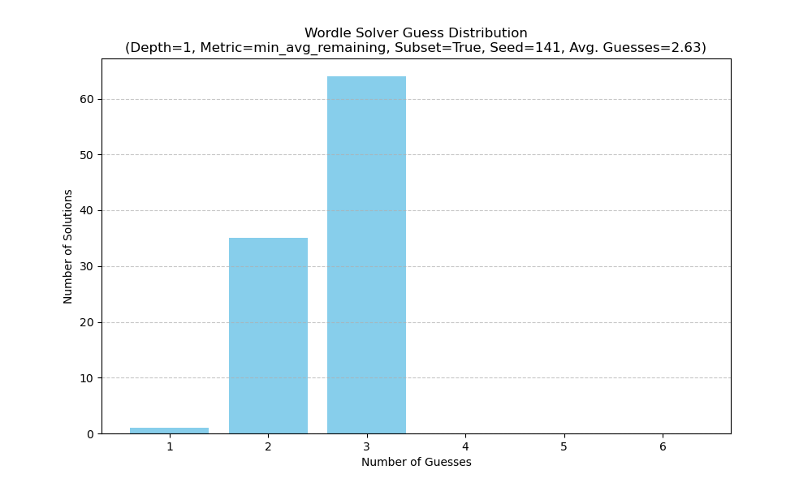

--- Solver Performance Report ---
Total solutions simulated: 100
Used a subset of 100 words for both solutions and guesses (Random Seed: 141).
Average guesses per game: 2.63

Overall Best Initial Guess: ALTER (Score: 3.52)

Guess Distribution:
  1 tries: 1 solutions
  2 tries: 35 solutions
  3 tries: 64 solutions

--- Game Details ---

Solution: TROVE (Won in 2 tries)
  1. ALTER -> bbyyy
  2. TROVE -> ggggg

Solution: AUDIT (Won in 2 tries)
  1. ALTER -> gbybb
  2. AUDIT -> ggggg

Solution: STOUT (Won in 3 tries)
  1. ALTER -> bbybb
  2. PHONE -> bbgbb
  3. STOUT -> ggggg

Solution: FIBRE (Won in 3 tries)
  1. ALTER -> bbbyy
  2. TROVE -> bybbg
  3. FIBRE -> ggggg

Solution: SQUAT (Won in 3 tries)
  1. ALTER -> ybybb
  2. AUDIT -> yybbg
  3. SQUAT -> ggggg

Solution: ABIDE (Won in 2 tries)
  1. ALTER -> gbbyb
  2. ABIDE -> ggggg

Solution: LATCH (Won in 2 tries)
  1. ALTER -> yygbb
  2. LATCH -> ggggg

Solution: WREST (Won in 3 tries)
  1. ALTER -> bbyyy
  2. TROVE -> ygbby
  3. WREST -> ggggg

Solution: ALIEN (Won in 2 tries)
  1. ALTER -> ggbgb
  2. ALIEN -> ggggg

Solution: PHONE (Won in 3 tries)
  1. ALTER -> bbbyb
  2. BENCH -> byyby
  3. PHONE -> ggggg

Solution: SEDAN (Won in 2 tries)
  1. ALTER -> ybbyb
  2. SEDAN -> ggggg

Solution: HERON (Won in 3 tries)
  1. ALTER -> bbbyy
  2. TROVE -> byyby
  3. HERON -> ggggg

Solution: LARVA (Won in 2 tries)
  1. ALTER -> yybby
  2. LARVA -> ggggg

Solution: TRIED (Won in 2 tries)
  1. ALTER -> bbygy
  2. TRIED -> ggggg

Solution: PLAID (Won in 3 tries)
  1. ALTER -> ygbbb
  2. STOUT -> bbbbb
  3. PLAID -> ggggg

Solution: SWEET (Won in 2 tries)
  1. ALTER -> bbygb
  2. SWEET -> ggggg

Solution: WAGON (Won in 2 tries)
  1. ALTER -> ybbbb
  2. WAGON -> ggggg

Solution: FLASK (Won in 3 tries)
  1. ALTER -> ygbbb
  2. STOUT -> ybbbb
  3. FLASK -> ggggg

Solution: ELFIN (Won in 2 tries)
  1. ALTER -> bgbyb
  2. ELFIN -> ggggg

Solution: PIGGY (Won in 2 tries)
  1. ALTER -> bbbbb
  2. PIGGY -> ggggg

Solution: PRISM (Won in 3 tries)
  1. ALTER -> bbbby
  2. PIGGY -> gybbb
  3. PRISM -> ggggg

Solution: GROOM (Won in 3 tries)
  1. ALTER -> bbbby
  2. PIGGY -> bbybb
  3. GROOM -> ggggg

Solution: WACKY (Won in 3 tries)
  1. ALTER -> ybbbb
  2. WAGON -> ggbbb
  3. WACKY -> ggggg

Solution: INTRO (Won in 2 tries)
  1. ALTER -> bbgby
  2. INTRO -> ggggg

Solution: STORM (Won in 3 tries)
  1. ALTER -> bbyby
  2. TROVE -> yygbb
  3. STORM -> ggggg

Solution: VOCAL (Won in 3 tries)
  1. ALTER -> yybbb
  2. LATCH -> yybyb
  3. VOCAL -> ggggg

Solution: STILT (Won in 2 tries)
  1. ALTER -> byybb
  2. STILT -> ggggg

Solution: KARMA (Won in 3 tries)
  1. ALTER -> ybbby
  2. LATCH -> bgbbb
  3. KARMA -> ggggg

Solution: SUGAR (Won in 3 tries)
  1. ALTER -> ybbbg
  2. SQUAT -> gbygb
  3. SUGAR -> ggggg

Solution: LATTE (Won in 2 tries)
  1. ALTER -> yygyb
  2. LATTE -> ggggg

Solution: SHARD (Won in 3 tries)
  1. ALTER -> ybbby
  2. LATCH -> bybby
  3. SHARD -> ggggg

Solution: ETHER (Won in 2 tries)
  1. ALTER -> bbygg
  2. ETHER -> ggggg

Solution: TRUCK (Won in 3 tries)
  1. ALTER -> bbyby
  2. TROVE -> ggbbb
  3. TRUCK -> ggggg

Solution: GRILL (Won in 2 tries)
  1. ALTER -> bybby
  2. GRILL -> ggggg

Solution: PYGMY (Won in 3 tries)
  1. ALTER -> bbbbb
  2. PIGGY -> gbgbg
  3. PYGMY -> ggggg

Solution: BAYOU (Won in 3 tries)
  1. ALTER -> ybbbb
  2. WAGON -> bgbgb
  3. BAYOU -> ggggg

Solution: WHOOP (Won in 3 tries)
  1. ALTER -> bbbbb
  2. PIGGY -> ybbbb
  3. WHOOP -> ggggg

Solution: THETA (Won in 3 tries)
  1. ALTER -> ybyyb
  2. TROVE -> gbbby
  3. THETA -> ggggg

Solution: VERSE (Won in 3 tries)
  1. ALTER -> bbbyy
  2. TROVE -> bybyg
  3. VERSE -> ggggg

Solution: SLOSH (Won in 3 tries)
  1. ALTER -> bgbbb
  2. TROVE -> bbgbb
  3. SLOSH -> ggggg

Solution: ALTER (Won in 1 tries)
  1. ALTER -> ggggg

Solution: CLIMB (Won in 3 tries)
  1. ALTER -> bgbbb
  2. TROVE -> bbbbb
  3. CLIMB -> ggggg

Solution: ARROW (Won in 2 tries)
  1. ALTER -> gbbby
  2. ARROW -> ggggg

Solution: LUCKY (Won in 3 tries)
  1. ALTER -> bybbb
  2. WACKY -> bbggg
  3. LUCKY -> ggggg

Solution: ARMOR (Won in 2 tries)
  1. ALTER -> gbbbg
  2. ARMOR -> ggggg

Solution: ODDLY (Won in 3 tries)
  1. ALTER -> bybbb
  2. WACKY -> bbbbg
  3. ODDLY -> ggggg

Solution: WOKEN (Won in 2 tries)
  1. ALTER -> bbbgb
  2. WOKEN -> ggggg

Solution: STASH (Won in 3 tries)
  1. ALTER -> ybybb
  2. AUDIT -> ybbby
  3. STASH -> ggggg

Solution: SADLY (Won in 3 tries)
  1. ALTER -> yybbb
  2. LATCH -> ygbbb
  3. SADLY -> ggggg

Solution: SAVOR (Won in 3 tries)
  1. ALTER -> ybbbg
  2. SQUAT -> gbbyb
  3. SAVOR -> ggggg

Solution: PRIVY (Won in 3 tries)
  1. ALTER -> bbbby
  2. PIGGY -> gybbg
  3. PRIVY -> ggggg

Solution: FLIER (Won in 2 tries)
  1. ALTER -> bgbgg
  2. FLIER -> ggggg

Solution: STEAM (Won in 3 tries)
  1. ALTER -> ybyyb
  2. TROVE -> ybbby
  3. STEAM -> ggggg

Solution: RECUT (Won in 3 tries)
  1. ALTER -> bbyyy
  2. TROVE -> yybby
  3. RECUT -> ggggg

Solution: UNDUE (Won in 3 tries)
  1. ALTER -> bbbyb
  2. BENCH -> byybb
  3. UNDUE -> ggggg

Solution: FRUIT (Won in 3 tries)
  1. ALTER -> bbyby
  2. TROVE -> ygbbb
  3. FRUIT -> ggggg

Solution: LABOR (Won in 2 tries)
  1. ALTER -> yybbg
  2. LABOR -> ggggg

Solution: CABAL (Won in 3 tries)
  1. ALTER -> yybbb
  2. LATCH -> ygbyb
  3. CABAL -> ggggg

Solution: STONE (Won in 2 tries)
  1. ALTER -> bbyyb
  2. STONE -> ggggg

Solution: BENCH (Won in 2 tries)
  1. ALTER -> bbbyb
  2. BENCH -> ggggg

Solution: PENCE (Won in 3 tries)
  1. ALTER -> bbbyb
  2. BENCH -> bgggb
  3. PENCE -> ggggg

Solution: NEIGH (Won in 3 tries)
  1. ALTER -> bbbyb
  2. BENCH -> bgybg
  3. NEIGH -> ggggg

Solution: BULKY (Won in 3 tries)
  1. ALTER -> bybbb
  2. WACKY -> bbbgg
  3. BULKY -> ggggg

Solution: ALOFT (Won in 2 tries)
  1. ALTER -> ggybb
  2. ALOFT -> ggggg

Solution: LARGE (Won in 3 tries)
  1. ALTER -> yybyy
  2. TROVE -> bybbg
  3. LARGE -> ggggg

Solution: ARENA (Won in 2 tries)
  1. ALTER -> gbbyy
  2. ARENA -> ggggg

Solution: NIGHT (Won in 3 tries)
  1. ALTER -> bbybb
  2. PHONE -> bybyb
  3. NIGHT -> ggggg

Solution: KOALA (Won in 3 tries)
  1. ALTER -> yybbb
  2. LATCH -> yybbb
  3. KOALA -> ggggg

Solution: OUGHT (Won in 3 tries)
  1. ALTER -> bbybb
  2. PHONE -> byybb
  3. OUGHT -> ggggg

Solution: GULCH (Won in 3 tries)
  1. ALTER -> bybbb
  2. WACKY -> bbybb
  3. GULCH -> ggggg

Solution: ADULT (Won in 2 tries)
  1. ALTER -> gyybb
  2. ADULT -> ggggg

Solution: ALLAY (Won in 2 tries)
  1. ALTER -> ggbbb
  2. ALLAY -> ggggg

Solution: BAWDY (Won in 3 tries)
  1. ALTER -> ybbbb
  2. WAGON -> ygbbb
  3. BAWDY -> ggggg

Solution: BROAD (Won in 3 tries)
  1. ALTER -> ybbby
  2. LATCH -> bybbb
  3. BROAD -> ggggg

Solution: STING (Won in 3 tries)
  1. ALTER -> bbybb
  2. PHONE -> bbbgb
  3. STING -> ggggg

Solution: CRICK (Won in 3 tries)
  1. ALTER -> bbbby
  2. PIGGY -> bybbb
  3. CRICK -> ggggg

Solution: SLACK (Won in 3 tries)
  1. ALTER -> ygbbb
  2. STOUT -> gbbbb
  3. SLACK -> ggggg

Solution: WEEDY (Won in 3 tries)
  1. ALTER -> bbbyb
  2. BENCH -> bgbbb
  3. WEEDY -> ggggg

Solution: UNDID (Won in 3 tries)
  1. ALTER -> bbbbb
  2. PIGGY -> bybbb
  3. UNDID -> ggggg

Solution: TRAWL (Won in 2 tries)
  1. ALTER -> yyyby
  2. TRAWL -> ggggg

Solution: FINCH (Won in 3 tries)
  1. ALTER -> bbbbb
  2. PIGGY -> bgbbb
  3. FINCH -> ggggg

Solution: PUDGY (Won in 3 tries)
  1. ALTER -> bbbbb
  2. PIGGY -> gbbgg
  3. PUDGY -> ggggg

Solution: WOULD (Won in 3 tries)
  1. ALTER -> bybbb
  2. WACKY -> gbbbb
  3. WOULD -> ggggg

Solution: DITTY (Won in 2 tries)
  1. ALTER -> bbgbb
  2. DITTY -> ggggg

Solution: MAYOR (Won in 3 tries)
  1. ALTER -> ybbbg
  2. SQUAT -> bbbyb
  3. MAYOR -> ggggg

Solution: ELECT (Won in 2 tries)
  1. ALTER -> bgyyb
  2. ELECT -> ggggg

Solution: REGAL (Won in 3 tries)
  1. ALTER -> yybyy
  2. TROVE -> bybby
  3. REGAL -> ggggg

Solution: FORTY (Won in 3 tries)
  1. ALTER -> bbyby
  2. TROVE -> yyybb
  3. FORTY -> ggggg

Solution: FECAL (Won in 2 tries)
  1. ALTER -> yybyb
  2. FECAL -> ggggg

Solution: PIANO (Won in 3 tries)
  1. ALTER -> ybbbb
  2. WAGON -> bybyy
  3. PIANO -> ggggg

Solution: MINCE (Won in 3 tries)
  1. ALTER -> bbbyb
  2. BENCH -> byggb
  3. MINCE -> ggggg

Solution: RAJAH (Won in 3 tries)
  1. ALTER -> ybbby
  2. LATCH -> bgbbg
  3. RAJAH -> ggggg

Solution: FIGHT (Won in 3 tries)
  1. ALTER -> bbybb
  2. PHONE -> bybbb
  3. FIGHT -> ggggg

Solution: FISHY (Won in 3 tries)
  1. ALTER -> bbbbb
  2. PIGGY -> bgbbg
  3. FISHY -> ggggg

Solution: MUSHY (Won in 3 tries)
  1. ALTER -> bbbbb
  2. PIGGY -> bbbbg
  3. MUSHY -> ggggg

Solution: FETCH (Won in 2 tries)
  1. ALTER -> bbgyb
  2. FETCH -> ggggg

Solution: CARAT (Won in 2 tries)
  1. ALTER -> ybyby
  2. CARAT -> ggggg

Solution: MOTOR (Won in 2 tries)
  1. ALTER -> bbgbg
  2. MOTOR -> ggggg

Solution: CAIRN (Won in 3 tries)
  1. ALTER -> ybbby
  2. LATCH -> bgbyb
  3. CAIRN -> ggggg

Solution: SONAR (Won in 3 tries)
  1. ALTER -> ybbbg
  2. SQUAT -> gbbgb
  3. SONAR -> ggggg

### Possible Solutions Used (Subset):
TROVE, AUDIT, STOUT, FIBRE, SQUAT, ABIDE, LATCH, WREST, ALIEN, PHONE, SEDAN, HERON, LARVA, TRIED, PLAID, SWEET, WAGON, FLASK, ELFIN, PIGGY, PRISM, GROOM, WACKY, INTRO, STORM, VOCAL, STILT, KARMA, SUGAR, LATTE, SHARD, ETHER, TRUCK, GRILL, PYGMY, BAYOU, WHOOP, THETA, VERSE, SLOSH, ALTER, CLIMB, ARROW, LUCKY, ARMOR, ODDLY, WOKEN, STASH, SADLY, SAVOR, PRIVY, FLIER, STEAM, RECUT, UNDUE, FRUIT, LABOR, CABAL, STONE, BENCH, PENCE, NEIGH, BULKY, ALOFT, LARGE, ARENA, NIGHT, KOALA, OUGHT, GULCH, ADULT, ALLAY, BAWDY, BROAD, STING, CRICK, SLACK, WEEDY, UNDID, TRAWL, FINCH, PUDGY, WOULD, DITTY, MAYOR, ELECT, REGAL, FORTY, FECAL, PIANO, MINCE, RAJAH, FIGHT, FISHY, MUSHY, FETCH, CARAT, MOTOR, CAIRN, SONAR

### Allowed Guesses Used (Subset):
TROVE, AUDIT, STOUT, FIBRE, SQUAT, ABIDE, LATCH, WREST, ALIEN, PHONE, SEDAN, HERON, LARVA, TRIED, PLAID, SWEET, WAGON, FLASK, ELFIN, PIGGY, PRISM, GROOM, WACKY, INTRO, STORM, VOCAL, STILT, KARMA, SUGAR, LATTE, SHARD, ETHER, TRUCK, GRILL, PYGMY, BAYOU, WHOOP, THETA, VERSE, SLOSH, ALTER, CLIMB, ARROW, LUCKY, ARMOR, ODDLY, WOKEN, STASH, SADLY, SAVOR, PRIVY, FLIER, STEAM, RECUT, UNDUE, FRUIT, LABOR, CABAL, STONE, BENCH, PENCE, NEIGH, BULKY, ALOFT, LARGE, ARENA, NIGHT, KOALA, OUGHT, GULCH, ADULT, ALLAY, BAWDY, BROAD, STING, CRICK, SLACK, WEEDY, UNDID, TRAWL, FINCH, PUDGY, WOULD, DITTY, MAYOR, ELECT, REGAL, FORTY, FECAL, PIANO, MINCE, RAJAH, FIGHT, FISHY, MUSHY, FETCH, CARAT, MOTOR, CAIRN, SONAR

Runtime: 8.68 seconds
