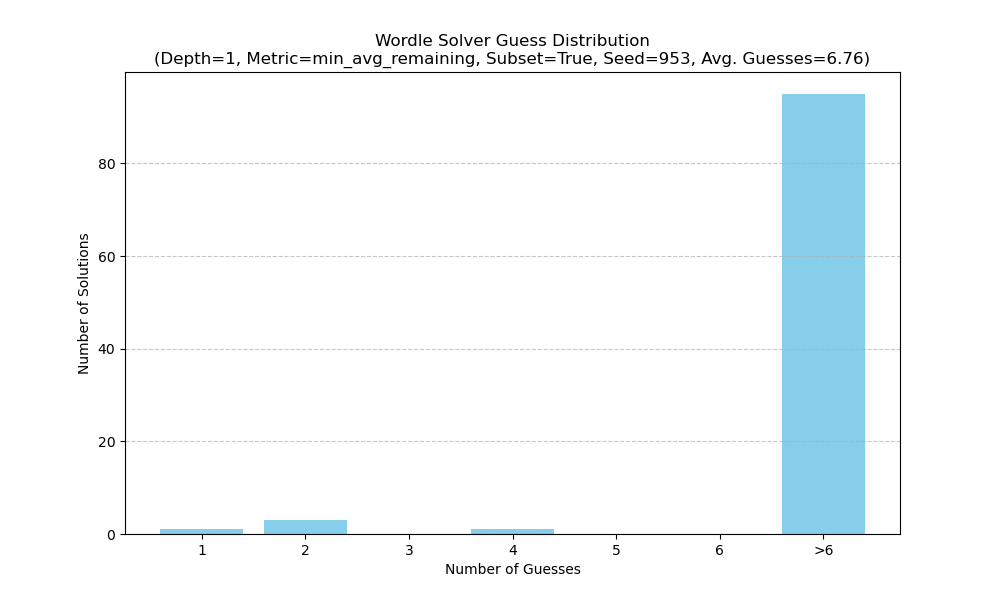

# Test Report: Wordle Solver Simulation

## 1. What was done
A simulation was run using the Wordle solver against a subset of 100 words from the `wordle_answers.txt` list (Random Seed: 953). The set of allowed guesses was also limited to this same subset.

## 2. Why it was done
This test was performed to evaluate the performance of the Wordle solver.

## 3. What was specifically tested
The solver's performance was tested with the following configuration:
*   **Search Depth**: 1 (greedy approach)
*   **Optimization Metric**: `min_avg_remaining` (minimizing average remaining solutions)
*   **Dataset**: Subset of 100 words from `wordle_answers.txt` for both solutions and allowed guesses (Random Seed: 953).

## 4. Results
```

--- Solver Performance Report ---
Total solutions simulated: 100
Used a subset of 100 words for both solutions and guesses (Random Seed: 953).
Average guesses per game: 6.76

Guess Distribution:
  1 tries: 1 solutions
  2 tries: 3 solutions
  4 tries: 1 solutions
  Failed (>6 tries): 95 solutions

Solutions that failed to be solved within 6 tries:
- actor
- happy
- retro
- inane
- slash
- humid
- brink
- weigh
- reign
- viper
- charm
- micro
- field
- noose
- banjo
- harem
- nudge
- lorry
- mount
- label
- meaty
- beech
- scrap
- spell
- crumb
- baggy
- quilt
- tawny
- shell
- lowly
- tutor
- geese
- canal
- tenet
- stunt
- cable
- fetal
- humus
- bride
- snide
- dingy
- mogul
- gloss
- sewer
- roger
- recut
- refit
- abbot
- dully
- enter
- cheer
- irate
- waver
- stock
- furry
- cabin
- fight
- fleck
- canoe
- mason
- leery
- price
- grade
- erase
- boxer
- scoff
- wield
- stern
- poker
- stein
- entry
- cater
- alley
- inlet
- spout
- shoot
- enact
- laden
- align
- nobly
- coast
- niche
- navel
- final
- pedal
- adore
- betel
- llama
- vital
- skulk
- spiny
- vegan
- owing
- tread
- thief

Runtime: 130.77 seconds
```

## 5. Guess Distribution Plot



## 6. Runtime
The simulation completed in 130.77 seconds.
